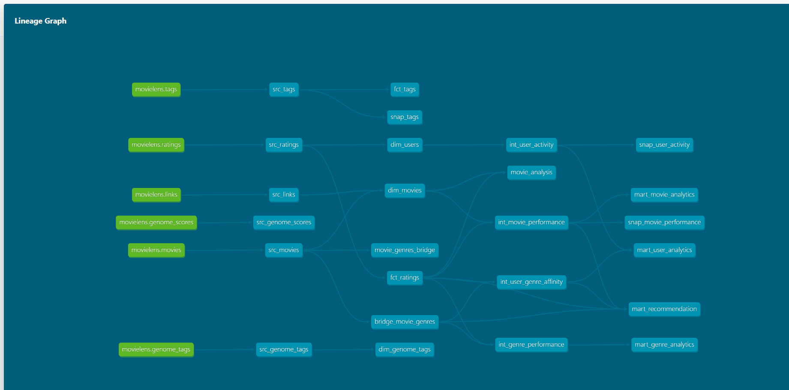
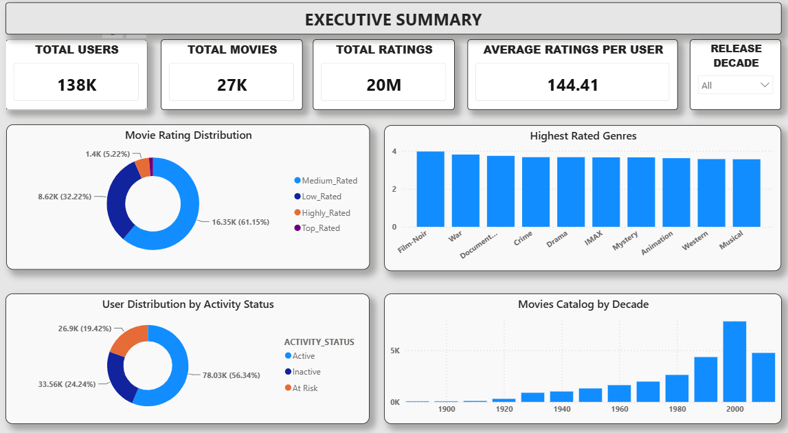
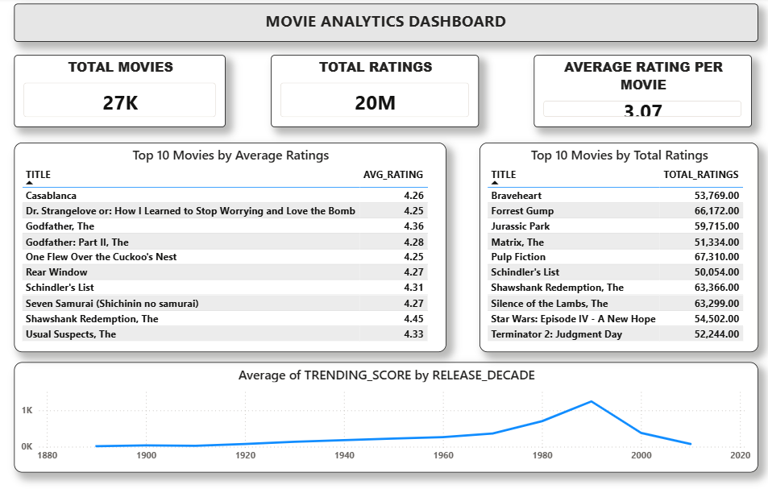
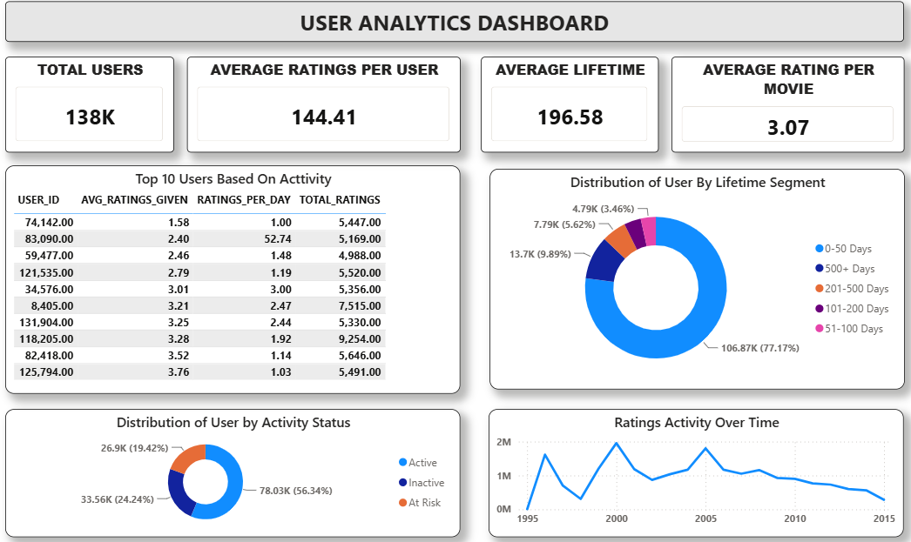
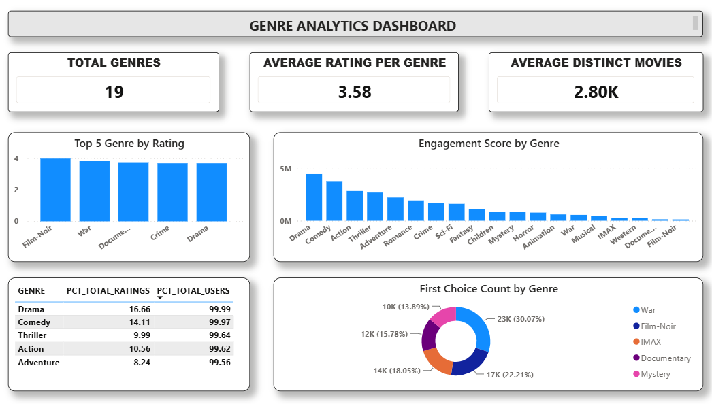

# 🎬 Netflix Analytics Engineering Platform

> End-to-end Analytics Engineering solution built using AWS S3, Snowflake, dbt, SQL, and Power BI.

This project transforms the MovieLens 20M dataset into business-ready analytical models and interactive dashboards. The platform answers questions around user engagement, movie performance, genre trends, and recommendation analytics using modern Analytics Engineering practices.

---

# 🚀 Architecture

```text
MovieLens CSV Files
        │
        ▼
AWS S3 Bucket
        │
        ▼
Snowflake External Stage
        │
        ▼
Snowflake RAW Tables
        │
        ▼
dbt Sources
        │
        ▼
dbt Staging Models
        │
        ▼
dbt Intermediate Models
        │
        ▼
Fact, Dimension & Bridge Models
        │
        ▼
Analytics Marts
        │
        ▼
Power BI Dashboards
```

---

# 🛠 Technology Stack

| Layer | Technology |
|---------|------------|
| Storage | AWS S3 |
| Data Warehouse | Snowflake |
| Transformation | dbt |
| Analytics Engineering | SQL |
| Visualization | Power BI |
| Version Control | Git & GitHub |

---

# 📊 Dataset

MovieLens 20M Dataset

- 20M+ Ratings
- 465K+ Tags
- 27K+ Movies
- 138K+ Users

Source Files:
- movies.csv
- ratings.csv
- tags.csv
- links.csv
- genome-tags.csv
- genome-scores.csv

---

# 🌐 dbt Lineage

The transformation layer follows a layered dbt architecture:

- Sources
- Staging Models
- Intermediate Models
- Fact Tables
- Dimension Tables
- Analytics Marts
- Snapshots



---

# ⭐ Data Model

The warehouse follows a dimensional modeling approach.

### Fact Tables
- fct_ratings
- fct_tags

### Dimension Tables
- dim_users
- dim_movies
- dim_genome_tags

### Bridge Table
- bridge_movie_genres

The bridge table resolves the many-to-many relationship between movies and genres and enables accurate genre-level analytics.


---

# 🏗 Data Pipeline

### Raw Layer
- raw_movies
- raw_ratings
- raw_tags
- raw_links
- raw_genome_tags
- raw_genome_scores

### Staging Layer
- src_movies
- src_ratings
- src_tags
- src_links
- src_genome_tags
- src_genome_scores

### Intermediate Layer
- int_movie_performance
- int_user_activity
- int_user_genre_affinity
- int_genre_performance

### Dimensions
- dim_movies
- dim_users
- dim_genome_tags

### Facts
- fct_ratings
- fct_tags

### Analytics Marts
- mart_movie_analytics
- mart_user_analytics
- mart_genre_analytics
- mart_recommendation

---

# ❓ Business Questions Solved

### User Analytics
- Who are the most active users?
- How often do users rate movies?
- What genres does each user prefer?
- Which users are becoming inactive?

### Movie Analytics
- Which movies are most popular?
- Which movies have the highest ratings?
- Which movies are trending?
- Which decades produce the strongest movie performance?

### Genre Analytics
- Which genres receive the highest ratings?
- Which genres drive the most engagement?
- Which genres attract the largest audiences?

### Recommendation Analytics
- What movie should be recommended next?
- Which users have similar tastes?

---

# 📈 Dashboard Showcase

## Executive Dashboard


## Movie Analytics Dashboard


## User Analytics Dashboard


## Genre Analytics Dashboard


---

# 📊 Key Insights

### Executive Insights
- The platform contains over 27K movies and millions of user interactions, enabling large-scale behavioral analysis.
- User engagement is concentrated among a relatively small segment of highly active users.
- Genre performance varies significantly, with some genres consistently achieving higher ratings and engagement.

### Movie Insights
- High popularity does not always correspond to the highest ratings.
- Trending score analysis helps identify movies balancing both audience reach and rating quality.
- Certain release decades consistently outperform others in overall movie performance.

### User Insights
- A small percentage of users generate a large share of total ratings.
- Long-tenured users typically interact with a broader range of genres.
- User activity declines over time, highlighting opportunities for retention strategies.

### Genre Insights
- Drama and Comedy are among the strongest engagement-driving genres.
- Some niche genres attract fewer users but achieve higher average ratings.
- Genre preferences provide valuable signals for recommendation-oriented analytics.

### Recommendation Insights
- Users with similar genre preferences can be grouped together for recommendation strategies.
- Historical ratings and tagging behavior provide strong inputs for future recommendation systems.

---

# 🔍 Technical Highlights

### Data Engineering
- AWS S3 ingestion layer
- Snowflake cloud warehouse
- External stages and COPY INTO ingestion

### Analytics Engineering
- Layered dbt architecture
- Sources, staging, intermediate, facts, dimensions, and marts
- Reusable macros and business logic abstraction

### Data Quality
- 60+ dbt tests
- Relationship validation
- Accepted values checks
- Null handling

### Historical Tracking
- dbt snapshots
- User activity tracking
- Historical auditability

---

# 💡 Key Design Decisions

### Genre Bridge Table
Implemented a bridge table to correctly model the many-to-many relationship between movies and genres.

### Trending Score
Created a custom trending score combining popularity and rating quality.

### Analytics Marts
Built dedicated marts for movie, user, genre, and recommendation analytics.

### Layered dbt Architecture
Separated business logic into staging, intermediate, fact, dimension, and mart layers for scalability and maintainability.

---

# 🎯 Project Outcomes

- Built an end-to-end analytics platform using AWS S3, Snowflake, dbt, and Power BI.
- Designed dimensional models supporting scalable reporting and self-service analytics.
- Implemented data quality testing, snapshots, and reusable macros.
- Delivered executive and analytical dashboards for business decision-making.

---

# 📚 Skills Demonstrated

- Analytics Engineering
- Snowflake
- AWS S3
- dbt
- SQL
- Data Modeling
- Data Quality Testing
- Snapshots
- Power BI
- Business Intelligence
